# 智能回复逻辑详细总结

## 🆕 最新重构 (2024.06.06)

### 提取分类功能到独立函数

**重构目标**: 将 `generateObject` 分类功能从 `generateSmartReplyWithLLM` 中提取出来，使降级时也能使用智能分类而不是硬编码 `"initial_inquiry"`。

**新增函数**:

```typescript
export async function classifyUserMessage(
  message: string = "",
  conversationHistory: string[] = [],
  data: ZhipinData
): Promise<MessageClassification>;
```

**改进的降级逻辑**:

```typescript
try {
  // LLM 智能回复逻辑
  return await generateSmartReplyWithLLM(message);
} catch (error) {
  console.error("LLM智能回复生成失败:", error);

  try {
    // 降级到原有逻辑，但先尝试进行分类
    const data = await loadZhipinData(preferredBrand);

    // 🆕 尝试使用分类功能确定回复类型
    let replyContext = "initial_inquiry"; // 默认值

    try {
      const classification = await classifyUserMessage(
        message,
        conversationHistory,
        data
      );
      replyContext = classification.replyType;
      console.log(`✅ 降级模式使用分类结果: ${replyContext}`);
    } catch (classificationError) {
      console.error("分类功能也失败，使用默认分类:", classificationError);
      // 保持默认值 "initial_inquiry"
    }

    return generateSmartReply(data, message, replyContext);
  } catch (dataError) {
    // 最终降级：通用错误回复
    return "抱歉，当前系统繁忙，请稍后再试或直接联系我们的客服。";
  }
}
```

**重构优势**:

- ✅ **分离关注点**: 分类逻辑独立，便于测试和维护
- ✅ **降级增强**: 即使 LLM 生成失败，仍能使用智能分类
- ✅ **类型安全**: 新增 `MessageClassification` 接口定义
- ✅ **向后兼容**: 不影响现有调用方式

---

## �� 核心架构：两步式 AI 回复系统

### 架构概览

```mermaid
graph TB
    A[候选人消息] --> B[第一步: generateObject 分类]
    B --> C[Zod Schema 验证]
    C --> D[提取结构化信息]
    D --> E[第二步: generateText 生成]
    E --> F[基于模板话术]
    F --> G[最终专业回复]

    B --> H[分类失败]
    H --> I[降级到规则引擎]
    I --> J[默认回复]
```



## 📊 第一步：智能分类与信息提取

### 使用模型

- **模型**: `qwen/qwen-max-2025-01-25`
- **方法**: `generateObject`
- **验证**: Zod Schema 结构化验证

### 分类类型 (11 种)

| 分类类型            | 描述                   | 关键词示例           |
| ------------------- | ---------------------- | -------------------- |
| `initial_inquiry`   | 初次咨询工作机会       | "找兼职"、"有工作吗" |
| `location_inquiry`  | 询问位置但无具体指向   | "哪里有工作"         |
| `location_match`    | 同时提到品牌和具体位置 | "杨浦区海底捞"       |
| `no_location_match` | 提到位置但无法匹配     | "浦西有工作吗"       |
| `schedule_inquiry`  | 询问工作时间安排       | "什么时候上班"       |
| `salary_inquiry`    | 询问薪资待遇           | "工资多少"           |
| `interview_request` | 表达面试意向           | "什么时候面试"       |
| `age_concern`       | 年龄相关问题（敏感）   | "我 XX 岁可以吗"     |
| `insurance_inquiry` | 保险福利问题（敏感）   | "有保险吗"           |
| `followup_chat`     | 需要跟进的聊天         | 后续沟通             |
| `general_chat`      | 一般性对话             | 其他话题             |

### 信息提取字段

```typescript
interface ExtractedInfo {
  mentionedBrand?: string | null; // 提到的品牌
  city?: string | null; // 工作城市
  mentionedLocations?: Array<{
    // 多候选位置
    location: string;
    confidence: number; // 0-1 置信度
  }> | null;
  mentionedDistrict?: string | null; // 区域信息
  specificAge?: number | null; // 具体年龄
  hasUrgency?: boolean | null; // 紧急需求
  preferredSchedule?: string | null; // 时间偏好
}
```

### 品牌名城市混淆处理

**问题**: "成都你六姐"品牌名包含城市名，容易被误识别为地点

**解决方案**:

```
⚠️ 重要提示：
- 品牌名称中可能包含城市名（如"成都你六姐"）
- 请勿将品牌名中的城市误识别为工作地点
- 实际工作城市是：上海
- 只有候选人明确询问具体区域/位置时，才提取为mentionedLocations
```

## 🔧 第二步：基于分类的回复生成

### 使用模型

- **模型**: `qwen/qwen-plus-latest`
- **方法**: `generateText`
- **参数**: `system` + `prompt`

### 系统提示词设计

每种分类类型都有专门的系统提示词：

#### 敏感话题处理示例

```typescript
age_concern: `年龄问题，严格按运营指南处理：
✅ 符合要求(18-45岁)："您的年龄没问题的"
❌ 超出要求："您附近目前没有岗位空缺了"
绝不透露具体年龄限制。`;

insurance_inquiry: `保险咨询，固定话术：
标准回复："有商业保险"
简洁明确，不展开说明。`;
```

#### 无匹配岗位处理

```typescript
no_location_match: `附近无门店，严格按照话术处理：
参考模板："目前你附近没有岗位空缺呢，{alternative_location}的门店考虑吗？"
⚠️重要：主动询问对方微信联系方式，告知以后有其他门店。`;
```

## 🏗️ buildContextInfo 上下文构建

### 智能门店筛选

1. **品牌过滤**: 优先匹配提到的品牌
2. **位置匹配**: 按置信度排序的多候选位置
3. **区域补充**: mentionedDistrict 作为补充条件

### 位置匹配逻辑

```typescript
// 按置信度降序排序
const sortedLocations = mentionedLocations.sort(
  (a, b) => b.confidence - a.confidence
);

// 尝试按置信度匹配位置
for (const { location, confidence } of sortedLocations) {
  const filteredStores = relevantStores.filter(
    (store) =>
      store.name.includes(location) ||
      store.location.includes(location) ||
      store.district.includes(location) ||
      store.subarea.includes(location)
  );

  if (filteredStores.length > 0) {
    relevantStores = filteredStores;
    console.log(`✅ 位置匹配成功: ${location} (置信度: ${confidence})`);
    break;
  }
}
```

### 动态话术模板加载

```typescript
// 添加品牌专属模板话术参考
const brandConfig = data.brands[targetBrand];
if (brandConfig && brandConfig.templates) {
  context += `\n📋 ${targetBrand}品牌专属话术模板：\n`;
  context += `主动沟通：${brandConfig.templates.proactive[0]}\n`;
  context += `位置咨询：${brandConfig.templates.inquiry[0]}\n`;
  // ... 其他模板
}
```

## 🛡️ 错误处理与降级机制

### Zod Schema 验证

**问题**: LLM 返回 `null` 值导致验证失败

**解决**: 所有可选字段支持 `.nullable().optional()`

```typescript
specificAge: z.number().nullable().optional().describe("提到的具体年龄");
```

### 自动降级

```typescript
try {
  // LLM 智能回复逻辑
  return await generateSmartReplyWithLLM(message);
} catch (error) {
  console.error("LLM智能回复生成失败:", error);
  // 降级到原有规则引擎
  const data = await loadZhipinData();
  return generateSmartReply(data, message, "initial_inquiry");
}
```

## 📝 多品牌数据架构支持

### 数据结构

```typescript
interface ZhipinData {
  city: string;
  defaultBrand?: string;
  stores: Store[];
  brands: Record<string, BrandConfig>; // 品牌配置映射
}

interface BrandConfig {
  templates: Templates; // 品牌专属话术
  screening: ScreeningRules; // 筛选规则
}
```

### 品牌识别逻辑

```typescript
// 动态品牌关键词生成
🏷️ 品牌关键词：${Object.keys(data.brands)
  .map((brand) => `"${brand}"`)
  .join("、")}
⭐ 默认品牌：${data.defaultBrand || getBrandName(data)}
```

## 🎯 运营指南严格执行

### 敏感话题固定回复

- **年龄合适**: "您的年龄没问题的"
- **年龄不合适**: "您附近目前没有岗位空缺了"
- **保险咨询**: "有商业保险"
- **残疾人咨询**: "不好意思"

### 无匹配时的处理

1. 主动询问微信联系方式
2. 告知"以后有其他门店空了可以再推给你"
3. 营造机会丰富感，避免"骗子"印象

### 回复长度控制

- 目标：10-20 字简洁回复
- 专业、热情的语调
- 严格遵循模板话术

## 🔄 架构优势

### 相比 Tool Calling 的优势

1. **结构清晰**: 分类 → 生成两步骤明确
2. **可控性强**: 每一步都有明确的输入输出
3. **易于调试**: 可以单独测试分类和生成阶段
4. **成本效率**: 避免复杂工具选择逻辑
5. **类型安全**: Zod Schema 严格验证

### 可扩展性

- 新增分类类型：在 enum 中添加
- 新增信息提取：在 extractedInfo 中扩展
- 新增话术模板：在品牌配置中定义
- 新增敏感话题：在系统提示中增加规则

---

**总结**: 新的两步式智能回复系统通过结构化分类和专业回复生成，实现了高精度、可控性强的招聘对话体验，完美契合了多品牌招聘业务的复杂需求。
