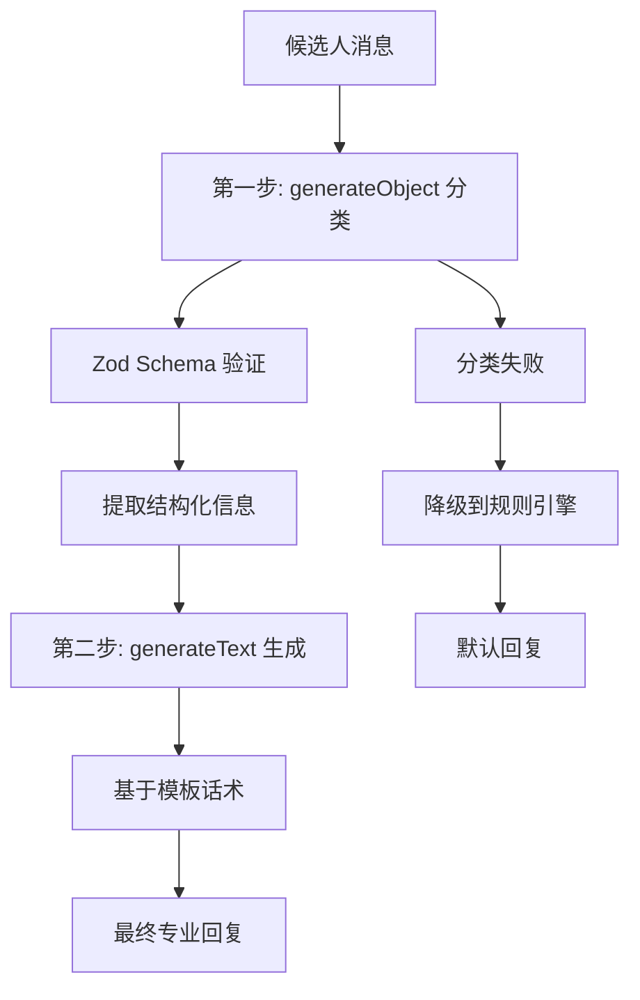

# AI-SDK Computer Use 系统架构指南

## 📋 概览

本文档是 AI-SDK Computer Use 项目的综合技术架构指南，涵盖了智能回复系统、考勤排班管理、类型安全架构等核心功能的完整实现。

## 🏗️ 核心架构：Zod Schema 优先

### Schema-First 开发模式

整个系统采用 **Zod Schema 优先** 的开发模式，所有类型定义都从 Zod Schema 生成：

```typescript
// Schema Definition
export const ScheduleTypeSchema = z.enum([
  "fixed", // 固定排班
  "flexible", // 灵活排班
  "rotating", // 轮班制
  "on_call", // 随叫随到
]);

// Generated TypeScript Type
export type ScheduleType = z.infer<typeof ScheduleTypeSchema>;
```

### 架构优势

- ✅ **单一数据源**：Schema 作为唯一的类型定义源头
- ✅ **运行时验证**：自动类型检查和数据验证
- ✅ **类型安全**：编译时和运行时双重保障
- ✅ **代码减少**：消除 ~150 行重复类型定义

## 🤖 智能回复系统

### 两步式 AI 架构



### 核心函数

```typescript
// 主要函数
export async function generateSmartReplyWithLLM(
  message: string = "",
  conversationHistory: string[] = []
): Promise<string>;

// 分类函数（独立提取）
export async function classifyUserMessage(
  message: string = "",
  conversationHistory: string[] = [],
  data: ZhipinData
): Promise<MessageClassification>;
```

### 模型配置

- **分类阶段**: `qwen/qwen-max-2025-01-25` (高精度)
- **生成阶段**: `qwen/qwen-plus-latest` (平衡性价比)

## 📊 分类系统

### 17 种回复类型

| 分类类型                    | 描述                   | 关键词示例           |
| --------------------------- | ---------------------- | -------------------- |
| `initial_inquiry`           | 初次咨询工作机会       | "找兼职"、"有工作吗" |
| `location_inquiry`          | 询问位置但无具体指向   | "哪里有工作"         |
| `location_match`            | 同时提到品牌和具体位置 | "杨浦区海底捞"       |
| `no_location_match`         | 提到位置但无法匹配     | "浦西有工作吗"       |
| `schedule_inquiry`          | 询问工作时间安排       | "什么时候上班"       |
| `salary_inquiry`            | 询问薪资待遇           | "工资多少"           |
| `interview_request`         | 表达面试意向           | "什么时候面试"       |
| `age_concern`               | 年龄相关问题（敏感）   | "我 XX 岁可以吗"     |
| `insurance_inquiry`         | 保险福利问题（敏感）   | "有保险吗"           |
| `followup_chat`             | 需要跟进的聊天         | 后续沟通             |
| `general_chat`              | 一般性对话             | 其他话题             |
| `attendance_inquiry`        | 出勤要求咨询（🆕）     | "一周要上几天班？"   |
| `flexibility_inquiry`       | 排班灵活性咨询（🆕）   | "可以换班吗？"       |
| `attendance_policy_inquiry` | 考勤政策咨询（🆕）     | "考勤严格吗？"       |
| `work_hours_inquiry`        | 工时要求咨询（🆕）     | "一周工作多少小时？" |
| `availability_inquiry`      | 时间段可用性咨询（🆕） | "现在还有位置吗？"   |
| `part_time_support`         | 兼职支持咨询（🆕）     | "支持兼职吗？"       |

### 信息提取

```typescript
interface ExtractedInfo {
  mentionedBrand?: string | null; // 提到的品牌
  city?: string | null; // 工作城市
  mentionedLocations?: Array<{
    // 多候选位置
    location: string;
    confidence: number; // 0-1 置信度
  }> | null;
  mentionedDistrict?: string | null; // 区域信息
  specificAge?: number | null; // 具体年龄
  hasUrgency?: boolean | null; // 紧急需求
  preferredSchedule?: string | null; // 时间偏好
}
```

## 📅 考勤排班系统

### 新增类型定义

#### 1. AttendanceRequirement (🆕 核心新增)

```typescript
export const AttendanceRequirementSchema = z.object({
  requiredDays: z.array(z.number().min(1).max(7)).optional(), // 必须工作的星期几
  minimumDays: z.number().min(0).optional(), // 每周最少工作天数
  description: z.string(), // 出勤要求描述
});
```

#### 2. SchedulingFlexibility

```typescript
export const SchedulingFlexibilitySchema = z.object({
  canSwapShifts: z.boolean(), // 是否可以换班
  advanceNoticeHours: z.number().min(0), // 提前通知小时数
  partTimeAllowed: z.boolean(), // 是否允许兼职
  weekendRequired: z.boolean(), // 是否要求周末工作
  holidayRequired: z.boolean(), // 是否要求节假日工作
});
```

#### 3. AttendancePolicy

```typescript
export const AttendancePolicySchema = z.object({
  punctualityRequired: z.boolean(), // 是否要求准时
  lateToleranceMinutes: z.number().min(0), // 迟到容忍分钟数
  attendanceTracking: z.enum(["strict", "flexible", "none"]),
  makeupShiftsAllowed: z.boolean(), // 是否允许补班
});
```

### 预定义排班模式

```typescript
export const ATTENDANCE_PATTERNS = {
  WEEKENDS: [6, 7], // 周末
  WEEKDAYS: [1, 2, 3, 4, 5], // 工作日
  FRIDAY_TO_SUNDAY: [5, 6, 7], // 周五到周日
  EVERYDAY: [1, 2, 3, 4, 5, 6, 7], // 每天
} as const;
```

## 🎯 智能回复指令配置

### 17 种回复指令

系统支持 17 种不同的回复指令类型，包括 **6 种考勤排班相关指令**：

#### 标准招聘指令

- `initial_inquiry` - 初次咨询回复
- `location_inquiry` - 位置询问回复
- `no_location_match` - 无位置匹配回复
- `salary_inquiry` - 薪资咨询回复
- `schedule_inquiry` - 排班咨询回复
- `interview_request` - 面试邀约回复
- `age_concern` - 年龄问题回复
- `insurance_inquiry` - 保险咨询回复
- `followup_chat` - 跟进聊天回复
- `general_chat` - 通用回复

#### 🆕 考勤排班指令

- `attendance_inquiry` - 出勤要求咨询
- `flexibility_inquiry` - 排班灵活性咨询
- `attendance_policy_inquiry` - 考勤政策咨询
- `work_hours_inquiry` - 工时要求咨询
- `availability_inquiry` - 时间段可用性咨询
- `part_time_support` - 兼职支持咨询

### 指令模板示例

```typescript
const replyPromptsConfig: ReplyPromptsConfig = {
  // 标准指令
  initial_inquiry: `作为招聘助手，参考这个模板回复: "你好，{city}各区有{brand}门店在招人，排班{hours}小时，时薪{salary}元，{level_salary}"。语气要自然，突出薪资。`,

  // 🆕 考勤排班指令
  attendance_inquiry: `出勤要求咨询，参考这个话术: "出勤要求是{attendance_description}，一周最少{minimum_days}天，时间安排可以和店长商量。"。强调灵活性和协商性。`,

  flexibility_inquiry: `排班灵活性咨询，参考这个话术: "排班方式是{schedule_type}，{can_swap_shifts}换班，{part_time_allowed}兼职，比较人性化的。"。突出灵活性和人性化管理。`,
};
```

## 💾 配置管理系统

### 配置服务架构

```typescript
// 核心配置接口
interface AppConfigData {
  brandData: ZhipinData; // 品牌和门店数据
  systemPrompts: SystemPromptsConfig; // 系统级提示词
  replyPrompts: ReplyPromptsConfig; // 智能回复指令
  activeSystemPrompt: keyof SystemPromptsConfig;
  metadata: ConfigMetadata; // 配置元信息
}
```

### 自动迁移和升级

```typescript
// 配置升级逻辑
export async function needsDataUpgrade(): Promise<boolean> {
  const config = await configService.getConfig();

  // 版本检查
  if (config?.metadata?.version !== "1.1.0") {
    return true;
  }

  // AttendanceRequirement 字段检查
  const hasAttendanceRequirements = config.brandData.stores.every((store) =>
    store.positions.every(
      (position) => position.attendanceRequirement !== undefined
    )
  );

  return !hasAttendanceRequirements;
}
```

## 🔧 多品牌架构支持

### 品牌配置结构

```typescript
interface ZhipinData {
  city: string;
  defaultBrand?: string;
  stores: Store[];
  brands: Record<string, BrandConfig>; // 🔑 关键：品牌配置映射
}

interface BrandConfig {
  templates: Templates; // 品牌专属话术
  screening: ScreeningRules; // 筛选规则
}
```

### 品牌识别和模板加载

```typescript
// 动态品牌话术加载
const brandConfig = data.brands[targetBrand];
if (brandConfig && brandConfig.templates) {
  context += `\n📋 ${targetBrand}品牌专属话术模板：\n`;
  context += `初次咨询：${brandConfig.templates.initial_inquiry[0]}\n`;
  context += `位置咨询：${brandConfig.templates.location_inquiry[0]}\n`;
}
```

## 🛡️ 运营指南和敏感话题

### 严格话术执行

#### 年龄相关话题

```typescript
age_concern: `年龄问题，严格按运营指南处理：
✅ 符合要求(18-45岁): "您的年龄没问题的"
❌ 超出要求: "您附近目前没有岗位空缺了"
绝不透露具体年龄限制。`;
```

#### 保险咨询话题

```typescript
insurance_inquiry: `保险咨询，使用固定话术:
标准回复: "有商业保险"
简洁明确，不展开说明。`;
```

### 无匹配岗位处理

```typescript
no_location_match: `附近无门店，按这个话术处理: 
"你附近暂时没岗位，{alternative_location}的门店考虑吗？"
⚠️ 重要：主动询问是否可以加微信，告知以后有其他机会可以推荐。`;
```

## 🔍 测试和验证

### Web 测试界面

- **路径**: `/test-llm-reply`
- **功能**: 预设消息测试、自定义消息测试、实时结果展示

### API 测试端点

- **端点**: `POST /api/test-llm-reply`
- **支持**: JSON 格式请求/响应、完整错误处理

### 验证覆盖

| 场景分类 | 测试消息示例             | 预期行为                        |
| -------- | ------------------------ | ------------------------------- |
| 初次咨询 | "你好，我想找兼职工作"   | 返回门店概况和薪资信息          |
| 位置询问 | "杨浦区有工作吗？"       | 匹配杨浦区门店信息              |
| 考勤咨询 | "出勤要求是什么？"       | 返回 AttendanceRequirement 详情 |
| 年龄问题 | "我 45 岁了，可以做吗？" | 年龄适合性判断                  |

## 🚀 E2B Tool 集成

### 完整集成实现

```typescript
// lib/e2b/tool.ts 中的实现
import { generateSmartReplyWithLLM } from "@/lib/utils/zhipin-data-loader";

const smartReply = await generateSmartReplyWithLLM(
  candidate_message || "",
  conversation_history || []
);
```

### 支持参数

- `candidate_message`: 候选人消息内容
- `conversation_history`: 对话历史数组
- `auto_input`: 是否自动输入生成的回复
- `reply_context`: 回复上下文类型（可选，LLM 会自动识别）

## 📊 错误处理和降级机制

### 多层次降级

```typescript
try {
  // 第一层：LLM 智能回复
  return await generateSmartReplyWithLLM(message);
} catch (error) {
  try {
    // 第二层：智能分类 + 规则引擎
    const classification = await classifyUserMessage(message, [], data);
    return generateSmartReply(data, message, classification.replyType);
  } catch (classificationError) {
    // 第三层：默认规则引擎
    return generateSmartReply(data, message, "initial_inquiry");
  }
}
```

### Zod Schema 容错

```typescript
// 支持 null 值的可选字段
specificAge: z.number().nullable().optional().describe("提到的具体年龄"),
mentionedBrand: z.string().nullable().optional().describe("提到的品牌名称"),
```

## 📈 性能和成本优化

### 模型选择策略

- **分类阶段**: 使用高精度模型确保准确性
- **生成阶段**: 使用平衡模型控制成本
- **降级机制**: 失败时使用本地规则引擎

### 缓存策略（计划中）

- 常见问题缓存
- 请求去重和防抖
- API 调用频率监控

## 🔄 向后兼容性

### 完全向后兼容

- ✅ 保留所有原有字段和接口
- ✅ 新字段标记为可选，迁移时自动补全
- ✅ 现有 API 调用无需修改
- ✅ 渐进式升级，不影响现有功能

### 数据迁移

```typescript
// 自动为现有岗位生成 AttendanceRequirement
if (!position.attendanceRequirement) {
  position.attendanceRequirement = generateDefaultAttendanceRequirement({
    name: position.name,
    urgent: position.urgent,
  });
}
```

## 📁 文件架构

### 核心文件

- `types/zhipin.ts` - Zod Schema 定义和类型生成
- `types/config.d.ts` - 应用配置类型定义
- `lib/utils/zhipin-data-loader.ts` - 智能回复核心逻辑
- `hooks/useConfigManager.ts` - 配置管理和验证
- `lib/services/config.service.ts` - 配置存储服务

### 修改文件列表

1. **`/types/zhipin.ts`**: 🔄 迁移到 Zod schema，新增 AttendanceRequirement 等类型
2. **`/types/config.d.ts`**: 🔄 采用 Zod schema 架构
3. **`/lib/data/sample-data.ts`**: ✏️ 更新所有岗位的考勤排班数据
4. **`/lib/loaders/zhipin-data.loader.ts`**: ✏️ 增强智能回复生成和上下文构建
5. **`/hooks/useConfigManager.ts`**: 🔄 集成 Zod validation，移除重复 schema 定义
6. **`/lib/services/config.service.ts`**: ✏️ 支持 AttendanceRequirement 的数据升级

## 🎯 下一步优化

### 短期目标

- [ ] 性能监控和成本优化
- [ ] A/B 测试验证回复质量
- [ ] 多模型效果对比分析

### 长期目标

- [ ] 添加对话历史分析
- [ ] 个性化回复生成
- [ ] 多语言支持
- [ ] 实时学习和优化

---

**总结**: 本系统通过 Zod Schema 优先的架构设计，实现了类型安全、功能完整、高度可扩展的智能招聘对话系统。核心特性包括两步式 AI 回复、考勤排班管理、多品牌支持、严格话术执行和完善的错误处理机制。
