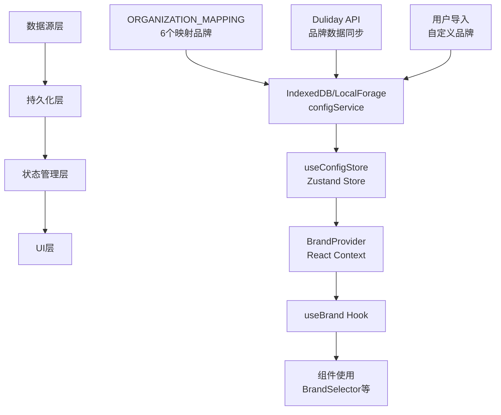

# 品牌数据流设计文档

## 概述

系统支持两种品牌数据来源：
1. **映射品牌**：在 `ORGANIZATION_MAPPING` 中定义的品牌（系统内置的6个品牌）
2. **自定义品牌**：用户通过导入配置文件添加的额外品牌

## 📊 整体架构



## 🔄 核心数据流程

### 1. 初始化流程

```
应用启动
  ↓
ConfigInitializer 组件加载
  ↓
检查并迁移硬编码数据（如果需要）
  ↓
BrandSyncManager 自动同步 ORGANIZATION_MAPPING 中缺失的品牌
  ↓
BrandProvider 从 configService 加载所有品牌数据
  ↓
品牌选择器显示所有品牌（映射的 + 自定义的）
```

### 2. 品牌同步流程

```
手动触发同步 或 自动初始化同步
  ↓
只同步 ORGANIZATION_MAPPING 中定义的品牌
  ↓
调用 Duliday API 获取最新数据
  ↓
mergeAndSaveSyncData 合并数据：
  - 保留现有品牌的话术模板
  - 更新门店和职位信息
  - 不影响自定义品牌
  ↓
更新 configService 中的数据
```

### 3. 导入流程

```
用户导入配置文件
  ↓
验证配置格式（AppConfigDataSchema）
  ↓
完全覆盖现有配置（包括话术模板）
  ↓
品牌选择器自动显示所有品牌
```

### 4. 品牌选择流程

```
用户通过 BrandSelector 选择品牌
  ↓
调用 setCurrentBrand(brand)
  ↓
自动保存到 localStorage
  ↓
所有使用 useBrand 的组件自动更新
```

## 🎯 关键组件职责

### ORGANIZATION_MAPPING (`lib/constants/organization-mapping.ts`)
- 定义系统支持的6个映射品牌
- 提供组织ID到品牌名称的映射
- 作为品牌同步的唯一数据源

### BrandSyncManager (`lib/services/brand-sync-manager.ts`)
- 管理品牌数据同步逻辑
- 只同步 ORGANIZATION_MAPPING 中的品牌
- 使用 API 路由避免 CSP 限制

### BrandProvider (`lib/contexts/brand-context.tsx`)
- 管理当前选中的品牌
- 合并映射品牌和自定义品牌列表
- 提供品牌相关数据给子组件

### useBrand Hook
返回数据：
- `currentBrand`: 当前选中的品牌
- `setCurrentBrand`: 切换品牌函数
- `availableBrands`: 所有可用品牌列表
- `brandData`: 完整的品牌数据
- `isLoaded`: 数据加载状态
- `isConfigLoaded`: 配置加载状态

## 💾 数据保护策略

### 导入时
- 完全覆盖所有数据（包括话术模板）
- 允许导入任意品牌
- 验证数据格式必须符合 schema

### 同步时
- 只同步映射品牌（ORGANIZATION_MAPPING 中的品牌）
- 保留现有品牌的话术模板
- 不删除用户自定义品牌
- 完全替换门店数据

## 🏗️ 使用场景

### 1. 标准使用
- 系统自动同步 6 个映射品牌
- 用户可以正常使用所有功能
- 品牌数据定期从 Duliday API 更新

### 2. 自定义扩展
- 用户导入包含额外品牌的配置
- 系统同时显示映射品牌和自定义品牌
- 同步不会影响自定义品牌

### 3. 测试环境
- 可以导入测试品牌配置
- 测试品牌会正常显示和使用
- 不会被自动同步覆盖

## 🔐 数据安全

### Content Security Policy (CSP)
- 浏览器环境不能直接调用外部 API
- 使用 Next.js API Routes 作为代理
- `/api/sync` 路由处理品牌同步请求

### Token 管理
- Duliday Token 存储在环境变量中
- 客户端通过 localStorage 传递 token
- API 路由验证 token 有效性

## 📋 实现细节

### 数据持久化
- 使用 IndexedDB/LocalForage 存储配置数据
- 自动降级到 localStorage（如果不支持）

### 状态管理
- Zustand Store 管理全局配置状态
- React Context 管理品牌选择状态

### 本地缓存
- localStorage 缓存当前选择的品牌
- 页面刷新后自动恢复

### 类型安全
- 完整的 TypeScript 类型定义
- Zod schema 运行时验证

## ⚠️ 注意事项

1. `ORGANIZATION_MAPPING` 是映射品牌的唯一数据源
2. 导入的配置文件可以包含任意品牌
3. 同步操作只影响映射品牌，不会删除额外品牌
4. 品牌选择器会显示所有可用品牌（映射的 + 自定义的）
5. 话术模板在同步时会被保留，在导入时会被覆盖

## 🧪 测试覆盖

### 单元测试
- `lib/__tests__/brand-sync.test.ts` - 品牌同步逻辑测试
- `lib/__tests__/config-import.test.ts` - 配置导入验证测试

### 测试场景
1. 自动同步保留非映射品牌
2. 同步保留现有话术模板
3. 导入完全覆盖所有数据
4. 数据格式严格验证